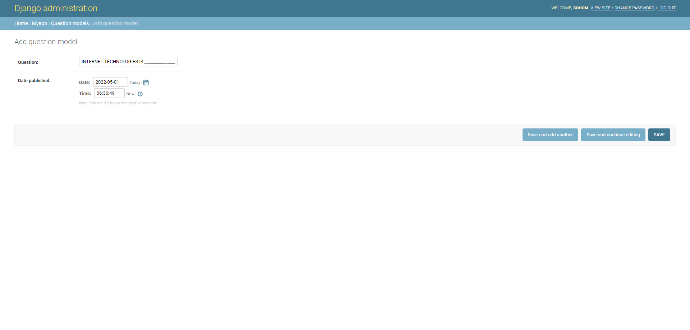
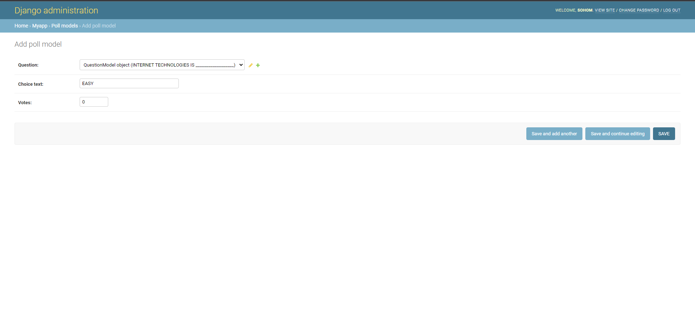

# itllab exam question probable soln (Batch - A1)

> **_NOTE:_** Only for educational purposes, pls don't copy from this during exam :)

To run/test:

- Run ```python manage.py makemigrations```
- Run ```python manage.py migrate```
- Run ```python manage.py createsuperuser```
- Use the ```/admin/``` endpoint to do the following database entries
  - Create the following question entry in QuestionModel: 
  - Create the following two poll entries in PollModel:  
- Navigate to `/myapp/`
